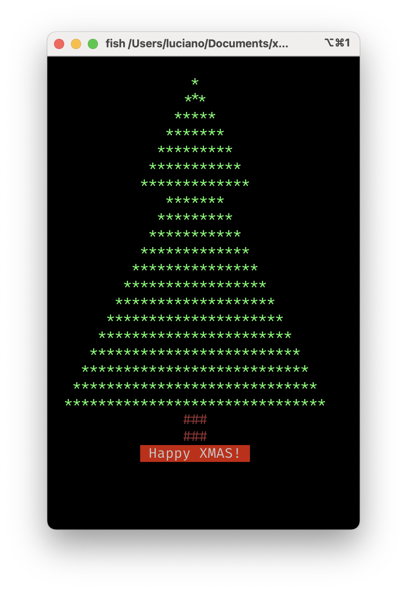

# xmas

A tiny rusty Xmas tree without bells and whistles




## Run

Just clone this repo and run:

```bash
cargo run
```

(Requires to have Rust installed)

## Contributing

Everyone is very welcome to contribute to this project.
You can contribute just by submitting bugs or suggesting improvements by
[opening an issue on GitHub](https://github.com/lmammino/xmas/issues).


## License

Licensed under [MIT License](LICENSE). © Luciano Mammino.
